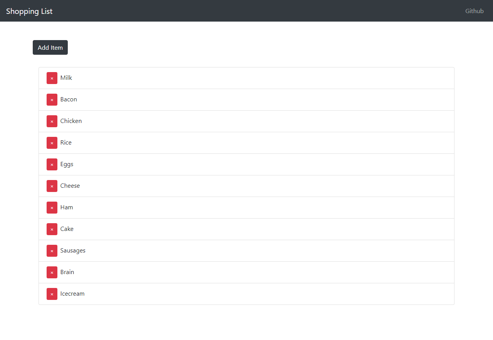

# Shopping List
> Webapp to write a list of items to buy when you go shopping

It uses React, Redux and Reactstrap in the frontend, and NodeJS with Express in the backend.

I also used Sequelize with PostgreSQL as a database for this project.

## Installing / Getting started

Clone the repo, install the dependencies of the server and client.
```shell
git clone https://github.com/ArmandoGraterol/shopping-list
cd shopping-list
npm install
cd client
npm install
```
And then you need 2 cmd open. 1 for running the server and another for the client.
```shell
cd shopping-list
node server
```

```shell
cd shopping-list/client
npm start
```

You have to insert the database name, username and password of your database in the index.js of the shopping-list/routes folder. The dialect is set to PostgreSQL but you can change it to others databases like mysql and sqlite, more info about that in [sequelize docs](http://docs.sequelizejs.com/).

## Features

* Adds items to shopping list.
* The items can be removed from the list.
* The items are saved in the database for the next time you get in the webapp.

## Licensing

The code in this project is licensed under MIT license.